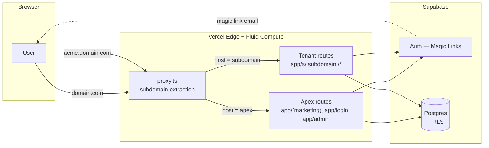
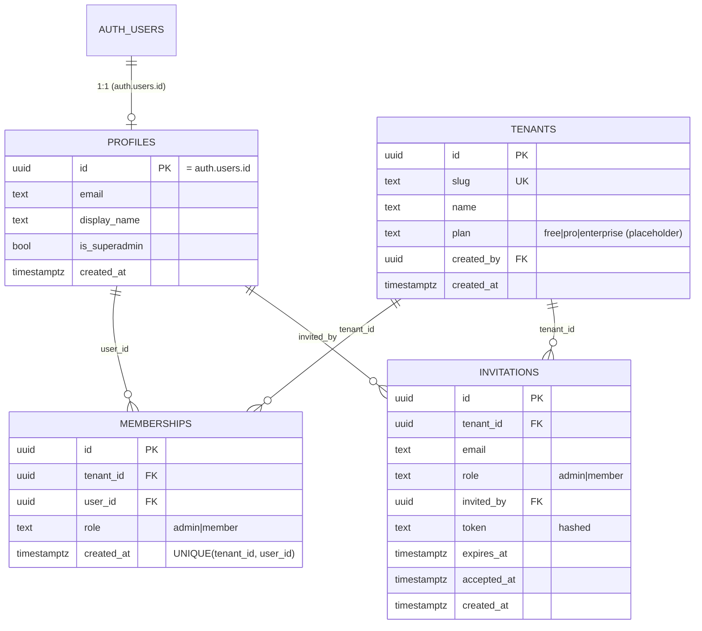
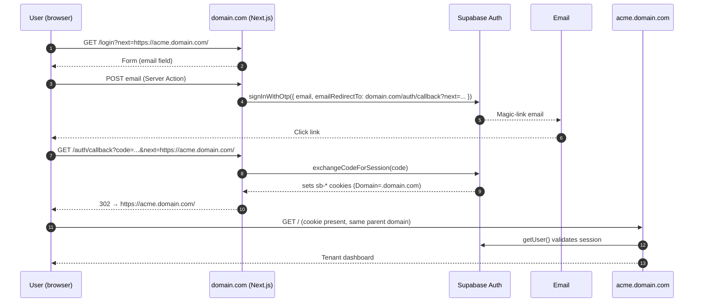

# Multi-Tenant SaaS Boilerplate — Technical Specification

> **Status:** DRAFT v0.1 — awaiting review.
> **Owner:** Istvan Eckert (eckert.isti@gmail.com)
> **Last updated:** 2026-05-17
> **Codebase baseline:** `vercel/platforms` starter, upgraded to Next.js 16 (commit `9b531e6`).

This document is the single source of truth for the architecture of the boilerplate. It must be approved before any application code is written. Subsequent companion documents: [`DESIGN.md`](./DESIGN.md) (UI tokens + component rules) and [`CLAUDE.md`](./CLAUDE.md) (rules for AI agents working in this repo).

---

## 1. Goals & Non-Goals

### 1.1 Goals
1. A reusable starting point for a B2B multi-tenant SaaS where each tenant lives on its own subdomain.
2. Centralized marketing and registration on the apex domain; tenant-isolated workspaces on subdomains.
3. Strict data isolation between tenants enforced **at the database layer** (Postgres RLS) — not only in application code.
4. Passwordless authentication (magic links) that works seamlessly across the apex domain and all subdomains via a single session cookie.
5. A role model that is small but expressive enough to cover 90% of B2B needs: `superadmin` (system-wide), `admin` and `member` (per tenant).
6. Codebase that is friendly to agentic development — well-documented routing conventions, schema, and UI patterns.

### 1.2 Non-Goals (out of scope for v0.1)
- Billing / subscription management (Stripe). Intentionally deferred; the schema leaves a `tenants.plan` placeholder.
- OAuth (Google, GitHub, etc.). The auth layer is abstracted so adding a provider is a config-only change in v0.2.
- Tenant-owned custom domains (e.g. `app.acme.com → tenant=acme`). The proxy.ts logic is structured to make this additive.
- Email-domain-based tenant auto-join.
- Audit logs, SOC2 controls, SAML SSO.
- Internationalization.
- Real-time features (Supabase Realtime) — wiring is left available but unused.

---

## 2. High-Level Architecture



Two things are deliberately centralized:
- **All authentication** happens against Supabase at `domain.com/login`. Subdomains that receive an unauthenticated request bounce the user to `https://domain.com/login?next=https://acme.domain.com/<original-path>`.
- **All data access** goes through Supabase using a session cookie scoped to `.domain.com`, so the same login is valid on every subdomain without re-authentication.

---

## 3. Routing & Subdomain Strategy

### 3.1 DNS / Vercel setup
- Apex domain `domain.com` → Vercel project root.
- Wildcard DNS record `*.domain.com` → same Vercel project.
- Both records must be claimed in Vercel's "Domains" tab on the project.
- Local development uses `*.localhost:3000` (Chromium/Firefox resolve this without `/etc/hosts` edits).
- Vercel preview deployments are accessed at `tenant---branch-name.vercel.app`; the existing proxy.ts already handles this pattern and will be preserved.

### 3.2 proxy.ts responsibilities
The existing `proxy.ts` (Next.js 16 rename of `middleware.ts`) is extended — not rewritten — with auth checks. Pseudocode:

```ts
// proxy.ts (target shape; not yet implemented)
export async function proxy(request: NextRequest) {
  const { pathname } = request.nextUrl;
  const subdomain = extractSubdomain(request);          // existing helper
  const session  = await getSupabaseSession(request);    // new — reads sb cookie

  // Apex domain
  if (!subdomain) {
    // Admin (= superadmin console) is gated separately, see §8
    if (pathname.startsWith('/admin') && !session) return redirectToLogin(request);
    return NextResponse.next();
  }

  // Subdomain — must be authenticated
  if (!session) return redirectToLogin(request, /*next=*/ request.url);

  // Confirm the user is a member of this tenant — done in proxy as a fast guard,
  // but RLS is still the ultimate enforcement layer.
  const ok = await isMember(session.user.id, subdomain);
  if (!ok) return NextResponse.redirect(new URL('https://' + APEX + '/no-access'));

  // Rewrite the root path of a subdomain to the tenant route group
  if (pathname === '/') {
    return NextResponse.rewrite(new URL(`/s/${subdomain}`, request.url));
  }
  return NextResponse.next();
}
```

Notes:
- `getSupabaseSession` uses `@supabase/ssr`'s edge-safe helpers; the cookie is read but not refreshed in proxy.ts (refresh happens in server components / actions to avoid race-y cookie writes in middleware).
- `isMember` is one cheap query: `select 1 from public.memberships m join public.tenants t on t.id = m.tenant_id where t.slug = $1 and m.user_id = $2 limit 1`. With the indexes specified in §5 this is sub-millisecond.
- The matcher remains `'/((?!api|_next|[\\w-]+\\.\\w+).*)'`.

### 3.3 Reserved subdomains
The following subdomains must be rejected at registration time and never be confused with tenants:
`www`, `app`, `admin`, `api`, `auth`, `login`, `signup`, `mail`, `email`, `static`, `cdn`, `assets`, `status`, `docs`, `help`, `support`, `blog`, `vercel`, `_next`.

Stored as a constant `RESERVED_SUBDOMAINS` in `lib/tenants/reserved.ts` and enforced in (a) the registration Server Action and (b) a Postgres `CHECK` constraint via a helper function.

### 3.4 Slug validation
- Regex: `^[a-z0-9](?:[a-z0-9-]{1,30}[a-z0-9])?$` (3–32 chars, lowercase, no leading/trailing hyphen).
- Enforced in: client form (instant feedback), Server Action (authoritative), Postgres (`CHECK` constraint + `UNIQUE`).

---

## 4. Database Schema

Postgres schema in the public schema unless noted. All identifiers lowercase per `supabase-postgres-best-practices/schema-lowercase-identifiers`.

### 4.1 ER diagram



### 4.2 DDL (target — not yet applied)

```sql
-- 0001_init.sql

-- ENUMS
create type public.tenant_role as enum ('admin', 'member');
create type public.tenant_plan as enum ('free', 'pro', 'enterprise');

-- PROFILES (extends auth.users 1:1)
create table public.profiles (
  id            uuid primary key references auth.users(id) on delete cascade,
  email         text not null,
  display_name  text,
  is_superadmin boolean not null default false,
  created_at    timestamptz not null default now()
);

-- Auto-create a profile row on signup
create or replace function public.handle_new_user()
returns trigger
language plpgsql
security definer
set search_path = public
as $$
begin
  insert into public.profiles (id, email)
  values (new.id, new.email)
  on conflict (id) do nothing;
  return new;
end $$;

create trigger on_auth_user_created
  after insert on auth.users
  for each row execute function public.handle_new_user();

-- TENANTS
create table public.tenants (
  id         uuid primary key default gen_random_uuid(),
  slug       text not null unique
             check (slug ~ '^[a-z0-9](?:[a-z0-9-]{1,30}[a-z0-9])?$'),
  name       text not null,
  plan       public.tenant_plan not null default 'free',
  created_by uuid not null references public.profiles(id),
  created_at timestamptz not null default now()
);
create index tenants_created_by_idx on public.tenants(created_by);

-- MEMBERSHIPS
create table public.memberships (
  id         uuid primary key default gen_random_uuid(),
  tenant_id  uuid not null references public.tenants(id) on delete cascade,
  user_id    uuid not null references public.profiles(id) on delete cascade,
  role       public.tenant_role not null,
  created_at timestamptz not null default now(),
  unique (tenant_id, user_id)
);
create index memberships_tenant_id_idx on public.memberships(tenant_id);
create index memberships_user_id_idx   on public.memberships(user_id);

-- INVITATIONS
create table public.invitations (
  id          uuid primary key default gen_random_uuid(),
  tenant_id   uuid not null references public.tenants(id) on delete cascade,
  email       text not null,
  role        public.tenant_role not null default 'member',
  invited_by  uuid not null references public.profiles(id),
  token_hash  text not null,                 -- store sha-256(token); raw token only in email
  expires_at  timestamptz not null,
  accepted_at timestamptz,
  created_at  timestamptz not null default now(),
  unique (tenant_id, email)                  -- one open invite per email per tenant
);
create index invitations_tenant_id_idx on public.invitations(tenant_id);
create index invitations_email_idx     on public.invitations(lower(email));
```

Index rationale (per `supabase-postgres-best-practices/schema-foreign-key-indexes`): every FK column has a covering index because RLS policies that filter on FK columns benefit from index scans.

---

## 5. Row Level Security (RLS)

RLS is **the** isolation boundary. Application-level checks are guard rails; if RLS is correct, a compromised application server cannot read another tenant's data.

### 5.1 Helper functions (SECURITY DEFINER)

```sql
-- Returns the calling user's profile id (= auth.users.id).
create or replace function public.current_user_id()
returns uuid language sql stable as $$
  select auth.uid()
$$;

-- True if the current user is a member of the given tenant.
create or replace function public.is_member_of(p_tenant uuid)
returns boolean
language sql
stable
security definer
set search_path = public
as $$
  select exists (
    select 1 from public.memberships
    where tenant_id = p_tenant and user_id = auth.uid()
  );
$$;

-- True if the current user has admin role in the given tenant.
create or replace function public.is_admin_of(p_tenant uuid)
returns boolean
language sql
stable
security definer
set search_path = public
as $$
  select exists (
    select 1 from public.memberships
    where tenant_id = p_tenant and user_id = auth.uid() and role = 'admin'
  );
$$;

-- Superadmin (global).
create or replace function public.is_superadmin()
returns boolean
language sql
stable
security definer
set search_path = public
as $$
  select coalesce((select is_superadmin from public.profiles where id = auth.uid()), false);
$$;
```

These functions are wrapped in `security definer` to bypass RLS on the underlying tables when checking membership — required to avoid infinite recursion in policies that reference `memberships`. See `supabase-postgres-best-practices/security-rls-performance`.

### 5.2 Policies

```sql
alter table public.profiles    enable row level security;
alter table public.tenants     enable row level security;
alter table public.memberships enable row level security;
alter table public.invitations enable row level security;

-- PROFILES: users see their own row; superadmin sees all.
create policy "profiles_self_select" on public.profiles
  for select using (id = auth.uid() or public.is_superadmin());

create policy "profiles_self_update" on public.profiles
  for update using (id = auth.uid())
  with check (id = auth.uid() and is_superadmin = (select is_superadmin from public.profiles where id = auth.uid()));
  -- ^ prevents self-elevation to superadmin

-- TENANTS: visible to members and superadmins.
create policy "tenants_member_select" on public.tenants
  for select using (public.is_member_of(id) or public.is_superadmin());

create policy "tenants_admin_update" on public.tenants
  for update using (public.is_admin_of(id) or public.is_superadmin());

-- Tenant creation: any authenticated user (= becomes admin via trigger, see §6).
create policy "tenants_authenticated_insert" on public.tenants
  for insert with check (auth.uid() is not null and created_by = auth.uid());

-- MEMBERSHIPS
create policy "memberships_member_select" on public.memberships
  for select using (public.is_member_of(tenant_id) or public.is_superadmin());

create policy "memberships_admin_write" on public.memberships
  for all using (public.is_admin_of(tenant_id) or public.is_superadmin())
  with check (public.is_admin_of(tenant_id) or public.is_superadmin());

-- INVITATIONS
create policy "invitations_admin_all" on public.invitations
  for all using (public.is_admin_of(tenant_id) or public.is_superadmin())
  with check (public.is_admin_of(tenant_id) or public.is_superadmin());
```

Bootstrap trigger — when a tenant is inserted, the creator is added as admin in the same transaction:

```sql
create or replace function public.bootstrap_tenant_owner()
returns trigger
language plpgsql
security definer
set search_path = public
as $$
begin
  insert into public.memberships (tenant_id, user_id, role)
  values (new.id, new.created_by, 'admin');
  return new;
end $$;

create trigger on_tenant_created
  after insert on public.tenants
  for each row execute function public.bootstrap_tenant_owner();
```

### 5.3 What is NOT in JWT claims
Tenant identity is intentionally *not* embedded in the JWT. The user has one session across all tenants; the active tenant is derived from the **subdomain in the URL**, then authorized via `is_member_of(t.id)`. This keeps tokens stable when a user belongs to many tenants.

---

## 6. Authentication Flow

### 6.1 Magic-link sign-in / sign-up sequence



### 6.2 Cookie scope (critical detail)
Supabase SSR cookies must be set with `Domain=.domain.com` (leading dot) so they are sent to both `domain.com` and every `*.domain.com`. This is configured in the `@supabase/ssr` cookie options:

```ts
// lib/supabase/cookies.ts (target shape)
export const cookieOptions = {
  domain: process.env.NODE_ENV === 'production' ? '.domain.com' : undefined,
  path: '/',
  sameSite: 'lax' as const,
  secure: process.env.NODE_ENV === 'production',
};
```

In development, `.localhost` is not honored by browsers as a cookie domain, but cookies set without an explicit domain on `localhost` and `*.localhost` are shared because they share the eTLD+1. This works automatically.

### 6.3 Centralized login redirect
- A user lands on `acme.domain.com/anything` with no session.
- proxy.ts redirects to `https://domain.com/login?next=<original-fully-qualified-url>`.
- After auth callback, the callback route validates `next` is an `https://*.domain.com` URL (or apex) before redirecting — open-redirect guard.

### 6.4 OAuth-ready abstraction
A thin `lib/auth/methods.ts` exposes `signInWithEmail(email)` and a stub `signInWithProvider(provider)` that throws "not enabled" for v0.1. Adding Google in v0.2 = configuring the provider in Supabase dashboard + uncommenting one button.

---

## 7. RBAC & Permissions

### 7.1 Role matrix

| Capability                                       | superadmin | tenant admin | tenant member |
|--------------------------------------------------|:----------:|:------------:|:-------------:|
| Sign in via magic link                           |     ✓      |      ✓       |       ✓       |
| Create a new tenant                              |     ✓      |      ✓¹      |      ✓¹       |
| View any tenant's data                           |     ✓      |              |               |
| View own tenants' welcome dashboard              |     ✓      |      ✓       |       ✓       |
| Edit tenant settings (`name`, `plan`)            |     ✓      |      ✓       |               |
| Invite members                                   |     ✓      |      ✓       |               |
| Remove members (incl. demote other admins)       |     ✓      |      ✓²      |               |
| Delete the tenant                                |     ✓      |      ✓       |               |
| Access `domain.com/admin` (system console)       |     ✓      |              |               |

¹ Any authenticated user may create a tenant; they become its first `admin`.
² An admin cannot remove themselves if they are the sole admin. Enforced in the Server Action; also a deferrable constraint on `memberships` is considered but rejected for v0.1 in favor of application-level enforcement.

### 7.2 Enforcement layers (defense in depth)
1. **UI** — buttons hidden / disabled when user lacks the role. Pure UX, never authoritative.
2. **Server Actions** — every mutation begins with `requireRole(tenantId, 'admin')` which queries `memberships` and throws on mismatch. The throw bubbles up as a generic 403 to the client.
3. **RLS** — the policies in §5.2 are the last line. Even if a Server Action is buggy, RLS prevents writes/reads that violate the role contract.
4. **proxy.ts** — coarse guard ("you are a member of this subdomain"), not role-aware.

---

## 8. Superadmin Console (`/admin` on apex)

- Path: `domain.com/admin` (already exists in the codebase, currently unauthenticated).
- Replaces the current Redis-backed admin page that lists subdomain emojis.
- New capabilities (v0.1): list all tenants, view member count per tenant, view created_at, hard-delete tenant.
- Hardened by: (a) proxy.ts redirects unauth → /login; (b) page-level `requireSuperadmin()` Server Component check; (c) RLS — without `is_superadmin = true` the relevant `select * from tenants` returns only the user's own.
- Bootstrap: the first superadmin is set manually via SQL (`update profiles set is_superadmin = true where email = '...'`). No UI to grant superadmin in v0.1.

---

## 9. Onboarding Flow

### 9.1 New-tenant signup (the only signup path in v0.1)

```mermaid
flowchart TD
  A[User on domain.com] --> B[Click 'Get started']
  B --> C[Form: email + tenant name<br/>slug auto-suggested, editable]
  C -->|user types name| C2[Client suggests slug<br/>= slugify name]
  C2 --> C
  C --> D[Server Action: validateAndCreatePendingSignup]
  D -->|invalid/reserved/taken slug| C
  D -->|valid| E[Store pending signup in cookie<br/>+ send magic link]
  E --> F[User clicks email]
  F --> G[/auth/callback]
  G --> H[Server Action: finalizePendingSignup<br/>creates tenant + bootstrap membership]
  H --> I[Redirect to acme.domain.com]
```

**Form fields** (in order, per resolved decision D1):
1. `email` — required.
2. `name` — required, free text, 1–60 chars. Becomes `tenants.name`.
3. `slug` — required, auto-populated from `name` via `slugify()` on every `name` keystroke *until the user has manually edited the slug field*; after manual edit, the auto-fill stops (tracked by a `slugDirty` ref). Editable inline; validated against the regex in §3.4.

**`slugify(name)` algorithm** (used both client-side for the live suggestion and server-side as a fallback):
1. Lowercase.
2. Replace any character outside `[a-z0-9]` with `-`.
3. Collapse consecutive hyphens.
4. Trim leading/trailing hyphens.
5. Truncate to 32 chars.
6. If empty after the above (e.g. name was all punctuation), fall back to `tenant-<6 random hex>`.
7. If the result collides with `RESERVED_SUBDOMAINS` or an existing tenant, the form surfaces the error — it does **not** silently mutate the slug. The user is in control of the final value.

Why pending-signup is stored in a cookie and not the DB: until the user clicks the magic link we have no authenticated session. Storing in a signed, short-lived cookie (15 min) avoids leaking unverified emails into Postgres and avoids a "claim this slug" race. The slug is *not* reserved during this window — collisions are handled by the unique constraint at finalization with a friendly error.

### 9.2 Invited-member onboarding
- Admin in tenant `acme` enters `bob@example.com`. Server Action creates a row in `invitations` with `token_hash` and sends Bob a magic-link-style email containing `domain.com/invite/<raw-token>`.
- Bob clicks → if not logged in, sees a magic-link prompt with email pre-filled and disabled. After auth → server validates token → inserts membership → redirects to `acme.domain.com`.
- Tokens expire in 7 days. One unaccepted invite per (tenant, email).

### 9.3 Single user, multiple tenants
A user may belong to multiple tenants. After login on apex with no `next`, they see a tenant chooser at `domain.com/choose-tenant` listing their memberships. Choosing one redirects to that subdomain.

---

## 10. Module / File Layout

```
saas-template/
├─ proxy.ts                          # subdomain routing + auth guard (Next.js 16)
├─ app/
│  ├─ (marketing)/                    # apex-only — landing
│  │  └─ page.tsx
│  ├─ login/page.tsx                 # apex — magic-link form
│  ├─ auth/callback/route.ts         # PKCE exchange
│  ├─ choose-tenant/page.tsx         # apex — tenant picker after login
│  ├─ signup/page.tsx                # apex — pending-signup form
│  ├─ invite/[token]/page.tsx        # apex — accept invitation
│  ├─ admin/                          # apex — superadmin console (existing path)
│  │  ├─ page.tsx
│  │  └─ dashboard.tsx
│  ├─ s/[subdomain]/                  # tenant scope (existing path)
│  │  ├─ layout.tsx                  # checks membership, sets active tenant context
│  │  ├─ page.tsx                    # tenant welcome dashboard
│  │  └─ settings/
│  │     ├─ page.tsx                 # admin-only: tenant name/plan
│  │     └─ members/
│  │        ├─ page.tsx              # admin-only: invite + list + remove
│  │        └─ actions.ts
│  ├─ layout.tsx
│  └─ globals.css
├─ components/
│  ├─ ui/                             # shadcn primitives (existing)
│  └─ ...
├─ lib/
│  ├─ supabase/
│  │  ├─ server.ts                   # createServerClient
│  │  ├─ middleware.ts               # createMiddlewareClient (used in proxy.ts)
│  │  ├─ client.ts                   # createBrowserClient
│  │  └─ cookies.ts                  # cookieOptions with Domain=.domain.com
│  ├─ auth/
│  │  ├─ methods.ts                  # signInWithEmail, signInWithProvider(stub)
│  │  ├─ session.ts                  # getSessionUser, requireUser
│  │  └─ rbac.ts                     # requireRole, requireSuperadmin
│  ├─ tenants/
│  │  ├─ reserved.ts                 # RESERVED_SUBDOMAINS
│  │  ├─ slug.ts                     # validation
│  │  └─ queries.ts                  # getTenantBySlug, listMyTenants, ...
│  ├─ invitations/
│  │  ├─ tokens.ts                   # crypto.randomBytes + sha256
│  │  └─ queries.ts
│  └─ utils.ts                        # cn, rootDomain, protocol (existing)
├─ supabase/
│  ├─ migrations/
│  │  ├─ 0001_init.sql
│  │  ├─ 0002_rls.sql
│  │  └─ 0003_triggers.sql
│  └─ seed.sql                        # optional
├─ SPECIFICATION.md
├─ DESIGN.md                          # (already exists, see §collision in chat)
└─ CLAUDE.md                          # to be authored after approval
```

---

## 11. Environment Variables

| Name | Scope | Purpose |
|---|---|---|
| `NEXT_PUBLIC_ROOT_DOMAIN`         | client+server | e.g. `domain.com` or `localhost:3000` (already in `lib/utils.ts`). |
| `NEXT_PUBLIC_SUPABASE_URL`        | client+server | Supabase project URL. |
| `NEXT_PUBLIC_SUPABASE_ANON_KEY`   | client+server | Anon key (safe for browser; RLS-protected). |
| `SUPABASE_SERVICE_ROLE_KEY`       | server only   | **Never exposed to client.** Used only for irreversible admin scripts (e.g. seeding superadmin). Not used by application code paths. |
| `KV_REST_API_URL` / `KV_REST_API_TOKEN` | -      | **To be removed** when Redis is dropped (see §13). |

Managed via `vercel env pull .env.local` per `vercel:env-vars`.

---

## 12. Migration Plan — Redis → Supabase

The starter persists tenants as Redis keys `subdomain:{name} → { emoji, createdAt }`. Migration steps:

1. Add Supabase deps (`@supabase/supabase-js`, `@supabase/ssr`), run migrations in §4.
2. Replace `lib/subdomains.ts` callers with `lib/tenants/queries.ts`. Keep the old file for one commit with a `@deprecated` JSDoc to make the diff reviewable.
3. Replace `lib/redis.ts` import sites in `app/actions.ts` and `app/admin/dashboard.tsx`.
4. Once green, delete `lib/redis.ts`, `lib/subdomains.ts`, and remove `@upstash/redis` from `package.json`.
5. Remove `KV_REST_API_*` env vars.

The legacy "emoji per subdomain" feature is **dropped**, not migrated. The new schema has no `emoji` column; the welcome dashboard greets users by tenant name instead.

---

## 13. Testing & Verification Strategy

For v0.1 — manual verification only (no automated test suite in the boilerplate; users will add their own):

- **Local hosts:** `localhost:3000`, `acme.localhost:3000`, `bob.localhost:3000`.
- **Auth E2E:** signup new tenant → magic-link email → tenant dashboard reachable.
- **Cross-tenant isolation:** while logged in as `alice@acme`, visit `bob.localhost:3000` — should redirect to `/no-access`.
- **Direct DB probe:** `select * from tenants` via the SQL editor while impersonating `alice@acme`'s JWT — must return only acme.
- **Reserved slug:** attempt to register `admin` — must fail at the form, the action, and the DB constraint.

---

## 14. Resolved Decisions (locked 2026-05-17)

| # | Decision | Resolution |
|---|---|---|
| D1 | Signup form fields. | **Require `name`; auto-suggest `slug` from name on the fly; slug is editable by the user.** See §9.1 for the slugify algorithm and the `slugDirty` rule. |
| D2 | Can one user belong to multiple tenants? | **Yes** — a user may be `admin` of N tenants and `member` of M. Tenant identity is derived from the URL host, not from the JWT. After login on apex with no `next` param, the user is sent to `/choose-tenant`. |
| D3 | Admin self-demotion rules. | **A user cannot remove themselves if they are the sole admin of the tenant.** Enforced in the `removeMember` Server Action. Same rule blocks role-change-to-member on the last admin. |
| D4 | Invitation acceptance — email must match. | **Yes — the authenticated user's email must equal the invitation's email** (case-insensitive). Mismatch returns a `403 invite_email_mismatch` and does not consume the token. |
| D5 | Supabase hosting. | **Supabase Cloud free tier.** Project provisioning is a manual one-time step; env keys go into Vercel via `vercel env`. |
| D6 | Existing `DESIGN.md`. | **Keep as-is.** The Airbnb-derived analysis is the canonical UI token + component reference for this boilerplate. Future UI work consults `DESIGN.md` for colors, type, radii, spacing, and component recipes. |
| D7 | Route group separation. | **Yes — keep `(marketing)` as a distinct route group** so apex-only pages cannot accidentally leak into the tenant scope at `app/s/[subdomain]/`. |

---

## 15. Skill Integration (how the repo's skills shape this spec and Phase ≥ 3)

| Skill | Applied where |
|---|---|
| `supabase-postgres-best-practices` | §4 schema (lowercase identifiers, FK indexes, ENUMs), §5 RLS (security definer helpers, performance, no recursion). |
| `vercel-react-best-practices`      | §3 proxy structure (cheap conditions before awaits), §6/§9 Server Actions (`server-auth-actions`), §10 component placement (no shared module state). |
| `vercel-composition-patterns`      | Future component design — explicit variants on Button/Card/Dialog rather than boolean props; compound components for the members table; React 19 (no forwardRef). |
| `frontend-design`                  | Phase 5 UI polish; reconciliation with the existing DESIGN.md. |
| (global) `multi-tenant-architecture` | Cross-checked the subdomain + cookie scoping approach. |
| (global) `supabase:supabase`       | Will drive the actual migration files + auth wiring in Phase 3. |
| (global) `vercel:auth` / `vercel:routing-middleware` | Will drive proxy.ts and callback route implementation. |

---

## 16. Revision Log
- **v0.2 (2026-05-17):** All open decisions D1–D7 resolved; §9.1 expanded with the slugify algorithm and `slugDirty` rule.
- **v0.1 (2026-05-17):** Initial draft.
